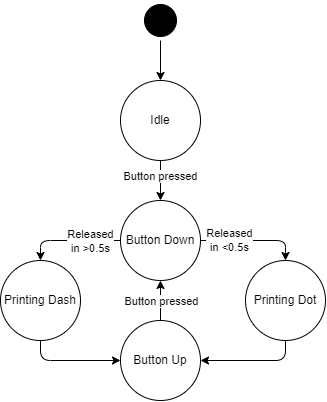

When the button is pressed down the current time (t1) is recorded. The new time is recorded when the button is released (t2). If t2 - t1 is greater than 0.5 seconds, a dash is printed to the console. If it is smaller, a dot is printed.

## Tasks

- Create PlatformIO project
- Add .ini settings to make Serial Monitor work
- Add pin/timing details to a config.h file
- Set up board to send signals on button press
- Create MorseManager class header file, define attributes/methods
- Implement Button Press Timing
- Work out what feels good for long/short press
- Implement press time to dot/dash calculation