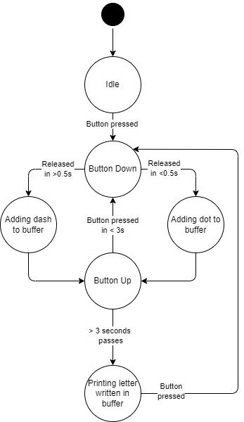
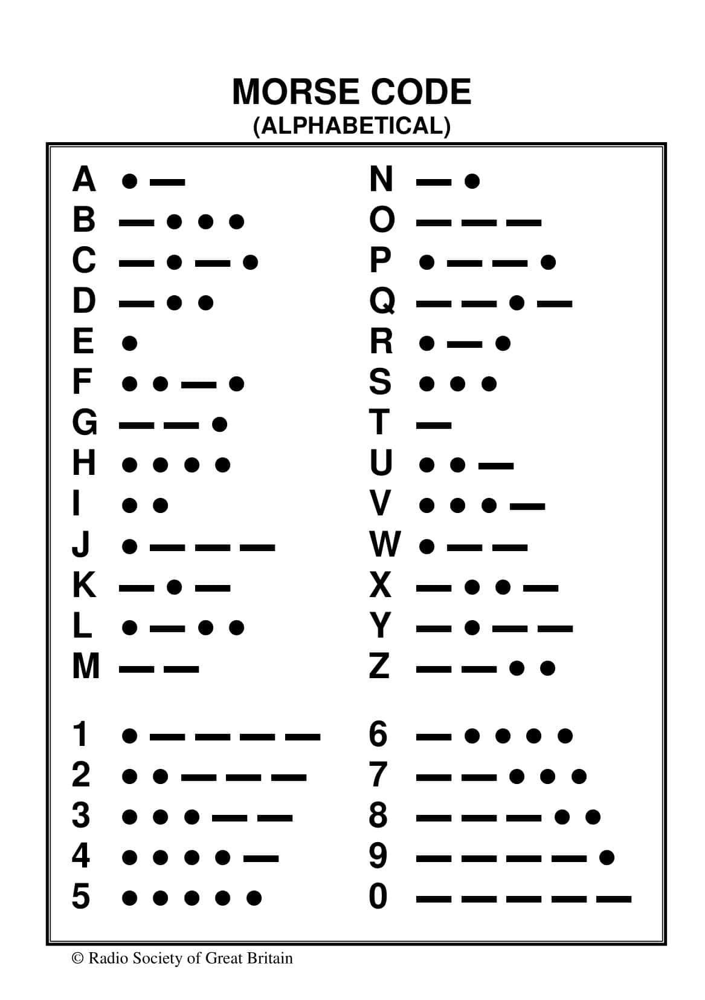

When the button is released, a dot or dash is addded to a buffer based on how long the user held it for. Afterwards, they can press it again within 3 seconds to continue adding to the buffer, or stop pressing it for the program to calculate what is being represented. The corresponding letter is printed if the buffer contents are a legal morse code sequence:

