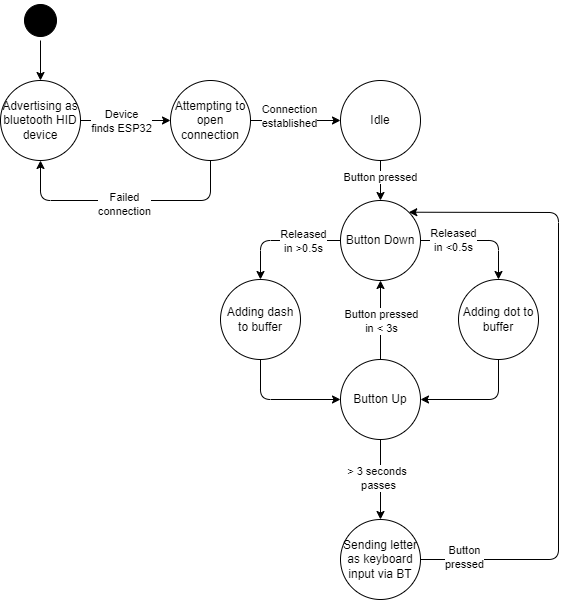

When the message would have been printed to the console before, it is instead sent to the connected device.

See below for info on doing bluetooth stuff.

### Refs

https://gist.github.com/manuelbl/66f059effc8a7be148adb1f104666467

https://github.com/T-vK/ESP32-BLE-Keyboard