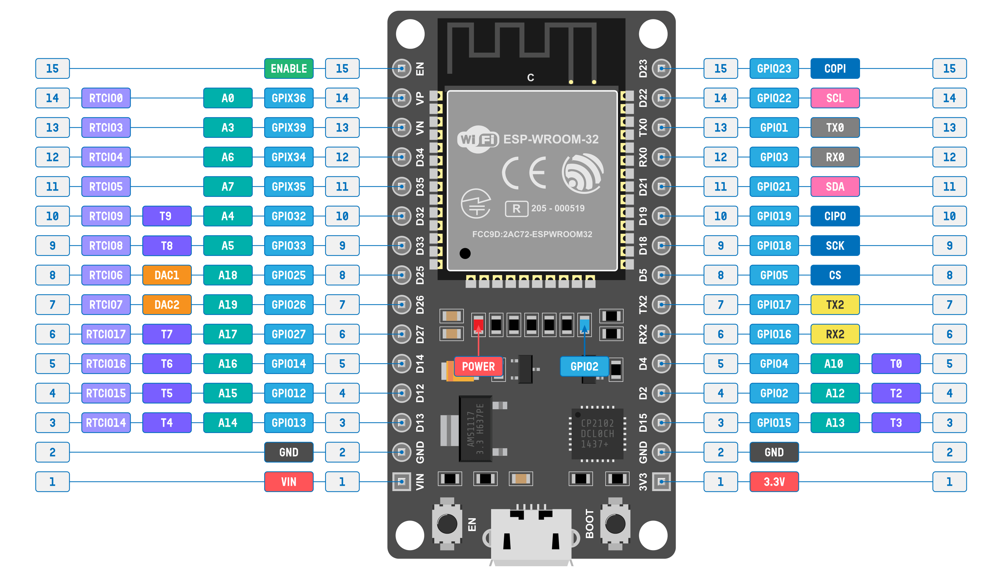

# Pinout Info

Look for the thing you want in the table and then find its location on the board with the diagram.

| GPIO | Pad Name    | Function 0 | Function 1 | Function 2 | Function 3 | Function 4 | Function 5   | Reset | Notes |
| :--- | :---------- | :--------- | :--------- | :--------- | :--------- | :--------- | :----------- | :---- | :---- |
| 0    | GPIO0       | GPIO0      | CLK_OUT1   | GPIO0      | –          | –          | EMAC_TX_CLK  | 3     | R     |
| 1    | U0TXD       | U0TXD      | CLK_OUT3   | GPIO1      | –          | –          | EMAC_RXD2    | 3     | –     |
| 2    | GPIO2       | GPIO2      | HSPIWP     | GPIO2      | HS2_DATA0  | SD_DATA0   | –            | 2     | R     |
| 3    | U0RXD       | U0RXD      | CLK_OUT2   | GPIO3      | –          | –          | –            | 3     | –     |
| 4    | GPIO4       | GPIO4      | HSPIHD     | GPIO4      | HS2_DATA1  | SD_DATA1   | EMAC_TX_ER   | 2     | R     |
| 5    | GPIO5       | GPIO5      | VSPICS0    | GPIO5      | HS1_DATA6  | –          | EMAC_RX_CLK  | 3     | –     |
| 6    | SD_CLK      | SD_CLK     | SPICLK     | GPIO6      | HS1_CLK    | U1CTS      | –            | 3     | –     |
| 7    | SD_DATA_0   | SD_DATA0   | SPIQ       | GPIO7      | HS1_DATA0  | U2RTS      | –            | 3     | –     |
| 8    | SD_DATA_1   | SD_DATA1   | SPID       | GPIO8      | HS1_DATA1  | U2CTS      | –            | 3     | –     |
| 9    | SD_DATA_2   | SD_DATA2   | SPIHD      | GPIO9      | HS1_DATA2  | U1RXD      | –            | 3     | –     |
| 10   | SD_DATA_3   | SD_DATA3   | SPIWP      | GPIO10     | HS1_DATA3  | U1TXD      | –            | 3     | –     |
| 11   | SD_CMD      | SD_CMD     | SPICS0     | GPIO11     | HS1_CMD    | U1RTS      | –            | 3     | –     |
| 12   | MTDI        | MTDI       | HSPIQ      | GPIO12     | HS2_DATA2  | SD_DATA2   | EMAC_TXD3    | 2     | R     |
| 13   | MTCK        | MTCK       | HSPID      | GPIO13     | HS2_DATA3  | SD_DATA3   | EMAC_RX_ER   | 2     | R     |
| 14   | MTMS        | MTMS       | HSPICLK    | GPIO14     | HS2_CLK    | SD_CLK     | EMAC_TXD2    | 3     | R     |
| 15   | MTDO        | MTDO       | HSPICS0    | GPIO15     | HS2_CMD    | SD_CMD     | EMAC_RXD3    | 3     | R     |
| 16   | GPIO16      | GPIO16     | –          | GPIO16     | HS1_DATA4  | U2RXD      | EMAC_CLK_OUT | 1     | –     |
| 17   | GPIO17      | GPIO17     | –          | GPIO17     | HS1_DATA5  | U2TXD      | EMAC_CLK_180 | 1     | –     |
| 18   | GPIO18      | GPIO18     | VSPICLK    | GPIO18     | HS1_DATA7  | –          | –            | 1     | –     |
| 19   | GPIO19      | GPIO19     | VSPIQ      | GPIO19     | U0CTS      | –          | EMAC_TXD0    | 1     | –     |
| 21   | GPIO21      | GPIO21     | VSPIHD     | GPIO21     | –          | –          | EMAC_TX_EN   | 1     | –     |
| 22   | GPIO22      | GPIO22     | VSPIWP     | GPIO22     | U0RTS      | –          | EMAC_TXD1    | 1     | –     |
| 23   | GPIO23      | GPIO23     | VSPID      | GPIO23     | HS1_STROBE | –          | –            | 1     | –     |
| 25   | GPIO25      | GPIO25     | –          | GPIO25     | –          | –          | EMAC_RXD0    | 0     | R     |
| 26   | GPIO26      | GPIO26     | –          | GPIO26     | –          | –          | EMAC_RXD1    | 0     | R     |
| 27   | GPIO27      | GPIO27     | –          | GPIO27     | –          | –          | EMAC_RX_DV   | 0     | R     |
| 32   | 32K_XP      | GPIO32     | –          | GPIO32     | –          | –          | –            | 0     | R     |
| 33   | 32K_XN      | GPIO33     | –          | GPIO33     | –          | –          | –            | 0     | R     |
| 34   | VDET_1      | GPIO34     | –          | GPIO34     | –          | –          | –            | 0     | R, I  |
| 35   | VDET_2      | GPIO35     | –          | GPIO35     | –          | –          | –            | 0     | R, I  |
| 36   | SENSOR_VP   | GPIO36     | –          | GPIO36     | –          | –          | –            | 0     | R, I  |
| 37   | SENSOR_CAPP | GPIO37     | –          | GPIO37     | –          | –          | –            | 0     | R, I  |
| 38   | SENSOR_CAPN | GPIO38     | –          | GPIO38     | –          | –          | –            | 0     | R, I  |
| 39   | SENSOR_VN   | GPIO39     | –          | GPIO39     | –          | –          | –            | 0     | R, I  |

# Diagram

For things like "pinMode" you use the GPIO number from the table, not the numbers in the diagram. 