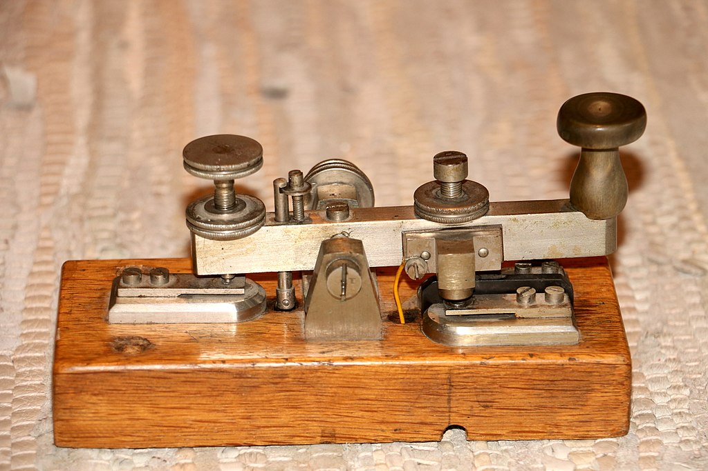

# ESP32 Morse Code Interpreter

Project for using an ESP32 as a [morse key](https://en.wikipedia.org/wiki/Telegraph_key).

See the [documentation folder](./Documentation/Plan.md) for more.

*"This radio stuff is all well and good but I really wish this thing had bluetooth."*